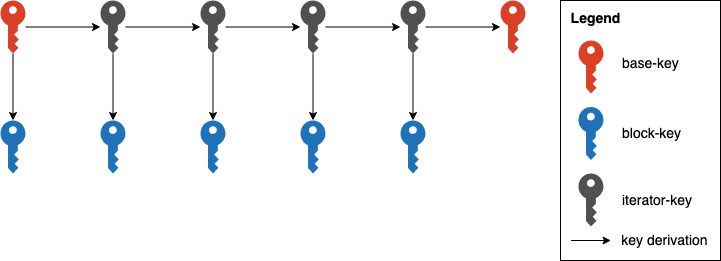

# Concept

## Visualization


The last operation is to overwrite the base-key for the next encryption.

## Python like Pseudo-Code

```python
def encrypt(message, key, iteratorSalt, outputSalt, difficulty=2):
  for block in message:
    outputKey = hash(key, outputSalt)
    key = hash(key, iteratorSalt)
    encrypted += block ^ outputKey[::difficulty]
```

## Security

- There is no possibility to recalculate the keys before hashing, because even the hashes are secret
- a part of each salt should be a secret for a higher entropy. The other part could be public and should be unique. You can use it for defending rainbow attacks
- as XOR alone is unbreakable, this algorithm is unbreakable as long there is no attack on the hashing algorithm
- each key is used only once (because of key derivation), private salt multiple times and public salt should be unique
- the block-key depends on the predecessor iterator-key and the salt
- even if the attacker knows an output-key, he couldn't recalculate the predecessor or following key

## Roadmap

- Change md5 hashing to a more modern hash or key derivation function like HMAC or HKDF. Each bit should have the same possibility to be 1 or 0
- more flexible CLI to specify the salt
- Concept how to save the next key
